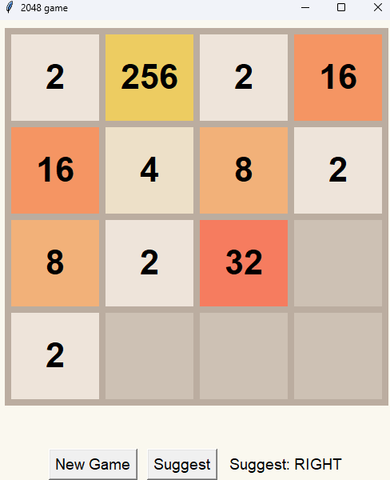

# classic-2048

A Python implementation of the 2048 puzzle game, built with Tkinter.

## How to play

1. Use the arrow keys to slide the tiles.
2. When two tiles with the same number collide, they merge into one.
3. Reach the **2048 tile** to win.

- **New Game** — reset the board
- **Suggest** — ask the AI for its recommended move

<br>



## Run

```powershell
python ui.py
```

Tkinter is bundled with Python — no extra install needed to run the game.

## Test

```powershell
pip install -e ".[dev]"
pytest
```

Tests cover all four move functions, following examples from the spec. Plus edge cases (all-empty row, all-same tile row, win, lose, AI suggestion). To verify moves interactively, run the game with `python ui.py`.

## Architecture

```
game.py   pure game logic — types, board, moves, win/lose
ai.py     greedy AI suggester, 1-step lookahead (depends on game.py)
ui.py     Tkinter front-end (depends on game.py and ai.py)
```

`game.py` functions are pure and return new boards (except `spawn_tile` which mutates in place). This makes the logic easy to test in isolation and reusable for future extensions.

## Move logic

Each move is decomposed into **compress → merge → compress** on rows. This is a standard decomposition and in this project it's been 
built specifically into the `_collapse_row_left` function. Right, up, and down are then implemented by reversing or transposing the board, collapsing left, and then inverting. 

## AI suggestor

The AI uses a greedy 1-step lookahead (tries the four moves and suggests whichever leaves the most empty cells). Offline model with no external dependencies.

## Assumptions

- Board is 4×4.
- Initial board: a random number of `2`s (between 2 and 8) placed at random cells.
- New-tile spawn probablities: 90% `2`, 10% `4`.
- Win condition: any cell reaches 2048, game stops.
- Loss condition: board is full and no move in any direction changes it. Game over!
